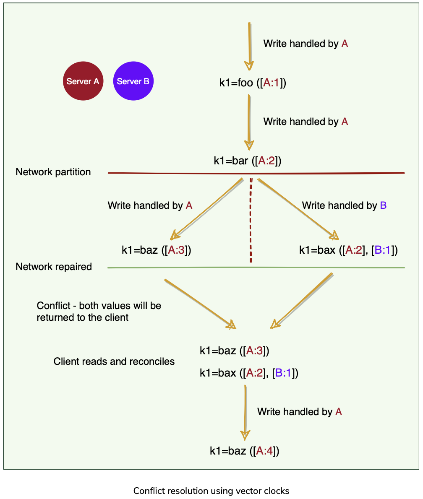

# 🧠 Dynamo: Distributed Key-Value Store (Amazon)

## 📑 Table of Contents

- [What is Dynamo?](#-what-is-dynamo)
- [Core Design Philosophy](#-core-design-philosophy)
- [Data Model](#-data-model)
- [Partitioning & Hashing](#-partitioning--hashing)
- [Consistent Hashing](#-consistent-hashing)
- [Problems with One Token per Node](#️-problems-with-one-token-per-node)
- [Virtual Nodes (Vnodes)](#-virtual-nodes-vnodes)
- [Replication](#-replication)
- [Preference List](#-preference-list)
- [Quorum Configuration (R, W, N)](#️-quorum-configuration-r-w-n)
- [Hinted Handoff (Always Writeable)](#-hinted-handoff-always-writeable)
- [Read Process (Detailed)](#-read-process-detailed)
- [Write Process (Detailed)](#️-write-process-detailed)
- [Gossip Protocol (Cluster Membership)](#️-gossip-protocol-cluster-membership)
- [Anti-Entropy (Merkle Trees)](#️-anti-entropy-merkle-trees)
- [Why Not Timestamps?](#️-why-not-timestamps)
- [Vector Clocks](#-vector-clocks)
- [Conflict Resolution](#-conflict-resolution)
- [CRDTs (Conflict-Free Replicated Data Types)](#-crdts-conflict-free-replicated-data-types)
- [Last-Write-Wins (LWW)](#-last-write-wins-lww)
- [Performance Characteristics](#-performance-characteristics)
- [When to Use Dynamo](#-when-to-use-dynamo)
- [Final Takeaway](#-final-takeaway)

## 📌 What is Dynamo?

**Dynamo** is a **highly available, distributed key-value store** designed by Amazon.

Many Amazon services such as:
- 🛒 Shopping Cart
- 📈 Best Seller Lists
- 🏷️ Product Catalog
- 📊 Sales Rank

only require **primary-key based access** (get/put by key).

👉 Using a multi-table relational database for these workloads would be:
- ❌ Overkill
- ❌ Hard to scale
- ❌ Less available under failures

So Dynamo was built specifically to optimize for:
- **Availability**
- **Scalability**
- **Fault tolerance**

---

## 🎯 Core Design Philosophy

> **Availability directly correlates with customer satisfaction.**

If the system is down:
- Customers can't browse
- Customers can't buy
- 💸 Amazon loses revenue

Hence Dynamo prioritizes:

- ✅ Always accepting reads and writes  
- ❌ Even if the system is temporarily inconsistent

Inconsistencies can usually be resolved later, often without users even noticing.

### 📌 Primary Goal
**High Availability over Strong Consistency**

This is a conscious **CAP tradeoff**.

---

## 🔑 Data Model

- Keys → arbitrary byte arrays  
- Values → arbitrary byte arrays  

No schema. No joins. No SQL.

### API Operations

```
get(key) → returns object with context (vector clock)
put(key, context, object) → stores object with causality info
```

The **context** is critical - it contains the vector clock for conflict detection.

---

## 🔢 Partitioning & Hashing

### MD5 Hashing

1. Apply **MD5** on the key  
2. Produces a **128-bit hash**  
3. The hash determines:
   - Where the data lives
   - Which nodes are responsible

---

## 🌀 Consistent Hashing

Dynamo uses **consistent hashing** to distribute data.

### How it works

- Hash space is visualized as a **ring**
- Each node owns a **range**
- Each range starts with a **token**

```
      0
      |
Node A | Node B
      |
  2^128 - 1
```

📌 A key is stored on the **first node clockwise** from its hash.

---

## ⚠️ Problems with One Token per Node

If each node owns **one large range**:

### ❌ 1. Node Add / Remove Pain
- Token recomputation
- High operational overhead

### ❌ 2. Hotspots
- Uneven key distribution
- Some nodes get overloaded

### ❌ 3. Node Rebuilding Pressure
- Only replica nodes can rebuild
- Replica nodes become hotspots

Example:

```
Server 1 : Token 1   (1  - 25)
Server 2 : Token 26  (26 - 50)
Server 3 : Token 51  (51 - 75)
Server 4 : Token 76  (76 - 100)
```

---

## 🧩 Virtual Nodes (Vnodes)

To fix these issues, Dynamo uses **Virtual Nodes (Vnodes)**.

### Key Ideas

- Hash range is split into **many small ranges**
- Each physical node owns **multiple vnodes**
- Each vnode has its own token

```
Physical Node A → 1, 5, 9, 13
Physical Node B → 2, 6, 10, 14
Physical Node C → 3, 7, 11, 15
Physical Node D → 4, 8, 12, 16
```

### Benefits

- ✅ Better load distribution
- ✅ Parallel & partial rebalancing
- ✅ Fewer hotspots
- ✅ Easier node recovery

> When a new node joins, it takes small ranges from many nodes, avoiding large data transfers.

---

## 🔁 Replication

### Replication Factor (N)

Each key is replicated on **N nodes**.

- One node acts as the **Coordinator**
- The coordinator:
  1. Stores data locally
  2. Replicates to **N − 1** other nodes

This is called **optimistic replication**.

📌 Dynamo provides **eventual consistency**.

---

## 📜 Preference List

**Preference List** = ordered list of nodes responsible for a key.

- Built by walking the hash ring clockwise
- Contains **more than N nodes** (usually N + some buffer)
- Used to handle failures gracefully

Example for key with hash landing at position 45:

```
Preference List (N=3):
1. Node B (primary coordinator)
2. Node C (replica 1)
3. Node D (replica 2)
4. Node E (backup)
5. Node F (backup)
```

If Node C fails, Node E takes over temporarily.

---

## ⚖️ Quorum Configuration (R, W, N)

Dynamo uses **tunable consistency** through three parameters:

- **N** = Number of replicas
- **W** = Write quorum (nodes that must acknowledge write)
- **R** = Read quorum (nodes contacted for read)

### Configuration Examples

| Configuration | Use Case | Trade-off |
|--------------|----------|-----------|
| R=1, W=1 | Fast reads/writes | Lowest consistency |
| R=2, W=2 (N=3) | Balanced | Good for most use cases |
| R=3, W=1 (N=3) | Read-heavy | Strong read consistency |
| R=1, W=3 (N=3) | Write-heavy | Strong write consistency |

### The R + W > N Rule

When **R + W > N**, you get **strong consistency** because:
- Read and write quorums **overlap**
- At least one node in read quorum has latest data

Example (N=3, R=2, W=2):
```
Write to: A, B ✅ (W=2 satisfied)
Read from: B, C → B has latest data ✅
```

### Sloppy Quorum (Dynamo's Approach)

Dynamo does **not** require strict quorums.

- Writes go to **any N healthy nodes**
- Nodes need not be the "correct" replicas from preference list

Example (`N = 3`):

```
Preference List: A, B, C
Server A ❌ (down)
Server B ✅
Server C ✅
Server D ✅ (temporary substitute)
```

📌 Result:
- Writes succeed (availability preserved)
- System remains available
- Data may temporarily diverge

---

## ✋ Hinted Handoff (Always Writeable)

### What is Hinted Handoff?

If the intended replica is unavailable:
- Another node accepts the write
- Stores it **with a hint**
- Forwards it later when the replica recovers

```
Write → Server D (substitute)
Hint  → "Originally meant for Server A"
```

### Process Flow

1. Client writes key K
2. Coordinator finds Server A is down
3. Writes to Server D instead with hint
4. Server D periodically checks if A is back
5. Once A recovers, D transfers data and deletes local copy

### Why it matters

- ✅ Writes never fail
- ✅ Even if only **one node is alive**, Dynamo works
- ✅ Availability is maximized

This makes Dynamo **"always writeable."**

---

## 📖 Read Process (Detailed)

### Step-by-Step Read Flow

1. **Client sends get(key)** to any Dynamo node
2. **Node becomes coordinator** for this request
3. **Coordinator identifies top N nodes** from preference list
4. **Sends read request to N nodes** (or just R nodes for optimization)
5. **Waits for R responses**
6. **Compares versions using vector clocks**
7. **Returns:**
   - Single version if all agree
   - Multiple versions if conflict detected (client must reconcile)

### Example Scenario

```
N=3, R=2
Key: shopping_cart_user123

Node A returns: [{item: "book"}, clock: {A:1}]
Node B returns: [{item: "book"}, clock: {A:1}]

→ Consistent! Return single version
```

### Conflict Scenario

```
Node A returns: [{item: "book"}, clock: {A:2, B:1}]
Node B returns: [{item: "book", "pen"}, clock: {A:1, B:2}]

→ Concurrent updates detected!
→ Return BOTH versions to client
→ Client merges (union of cart items)
```

---

## ✍️ Write Process (Detailed)

### Step-by-Step Write Flow

1. **Client sends put(key, context, value)** to any node
2. **Node becomes coordinator**
3. **Coordinator generates new vector clock**
   - Increments its own counter
   - Keeps causal history from context
4. **Writes to top N nodes from preference list**
5. **Waits for W acknowledgments**
6. **Returns success to client**

### Example Write

```
N=3, W=2
Client writes: put("cart_user123", context, {item: "laptop"})

Coordinator (Node A):
1. Creates new clock: {A:3, B:1}
2. Sends to nodes A, B, C
3. Receives ACK from A, B (W=2 satisfied ✅)
4. Returns success (C still processing in background)
```

---

## 🗣️ Gossip Protocol (Cluster Membership)

Dynamo uses a **gossip protocol** for:
- Node discovery
- Failure detection
- Cluster state propagation

### How Gossip Works

1. Every **T seconds**, each node:
   - Picks **random peer** from known nodes
   - Exchanges membership information
   - Updates its view of the cluster

2. Information spreads exponentially:
   - Round 1: 1 node knows
   - Round 2: 2 nodes know
   - Round 3: 4 nodes know
   - Round 4: 8 nodes know

### Intuition

Think office gossip:
- One person tells two
- They tell two more
- Soon everyone knows

📌 Properties:
- No leader
- No central coordinator
- Highly scalable
- Fault tolerant

### Failure Detection

Nodes detect failures through:
- **Heartbeat timeouts** - no gossip received in X seconds
- **Phi Accrual Failure Detector** - probability-based (not just binary up/down)

If failure probability exceeds threshold:
- Node marked as temporarily down
- Preference list routes around it
- Hinted handoff activates

---
#### 🌱 Seeds and **Logical Partitions** in the Dynamo Ring

**Seed nodes** are a small set of **externally discoverable, well-known nodes** (for example via static IPs or DNS).

Their purpose is **not data storage or coordination**, but **cluster discovery**.

---

#### 🚨 What “logical partition” means here

A **logical partition** means the cluster **accidentally splits into two or more independent rings**, for example:

* Network hiccup
* Restarted nodes
* Misconfigured nodes

Each group thinks:

> *“I am the whole cluster.”*

This is dangerous because:

* Each ring assigns tokens independently
* Same key maps to different nodes
* Data diverges permanently

---

#### 🛡️ How seed nodes prevent this

1. When a node starts, it **must contact a seed node**
2. The seed node provides the **existing ring metadata**
3. The node **joins the existing ring**, instead of forming a new one
4. Gossip then spreads the correct membership info

Because all nodes are configured with the **same seed nodes**, they all converge on **one shared ring view**.

---

#### ❗ Why “externally discoverable” matters

* Seeds are reachable via:

  * Static IPs
  * DNS
  * Load-balanced endpoints
* Even after restarts or partial outages, nodes can **re-discover the original ring**

Without seeds:

* Nodes may fail to find each other
* Multiple rings may form unintentionally

---

#### 🎯 One-paragraph summary (interview-ready)

> **Seed nodes are externally discoverable contact points that allow nodes to discover the existing Dynamo ring during startup. By ensuring that new or restarting nodes join the same ring instead of forming isolated ones, seed nodes help prevent logical partitions of the cluster.**

---

#### 🧠 One-line mental model

> **Seeds stop “split-brain rings” by giving every node the same starting point.**


## 🛠️ Anti-Entropy (Merkle Trees)

For **permanent failures** or long-term inconsistencies, Dynamo uses **Merkle Trees**.

### What is a Merkle Tree?

A **hash tree** where:
- Each leaf = hash of a data range
- Each parent = hash of its children
- Root = hash of entire dataset

```
         Root: H(ABC)
         /          \
    H(AB)            H(C)
    /    \             |
 H(A)   H(B)         H(C)
  |      |             |
 Data   Data         Data
```

### How It Works for Replica Comparison

1. Each node builds Merkle tree for its data ranges
2. Nodes compare trees starting from root
3. If roots match → data is identical ✅
4. If roots differ → traverse down to find divergent ranges
5. Only sync the different ranges

### Why Merkle Trees?

- ✅ **Efficient**: Compare millions of keys with just a few hashes
- ✅ **Precise**: Identify exactly which ranges differ
- ✅ **Scalable**: Tree depth is log(N)

Without Merkle trees, you'd need to compare every single key!

---

## ⏱️ Why Not Timestamps?

### Clock Skew Problem

- Clocks drift
- Node A's time ≠ Node B's time
- Ordering by timestamps is unreliable

Example:
```
Node A (clock slow): writes "value1" at 10:00:00
Node B (clock fast): writes "value2" at 09:59:55

→ Node B's write appears older, but actually happened later!
→ Wrong value wins if using timestamps
```

This is why Dynamo uses **vector clocks** instead.

---

## 🧮 Vector Clocks

### What is a Vector Clock?

A vector clock is a set of:

```
(node_id, counter)
```

Example:

```
{A:2, B:1, C:3}
```


### How Vector Clocks Work

Each node maintains a counter:
- **On write**: Increment your own counter
- **On merge**: Take maximum of all counters

### Example Evolution

```
Initial write at Node A:
{A:1}

Node B updates:
{A:1, B:1}

Node A updates again:
{A:2, B:1}

Node C updates:
{A:2, B:1, C:1}
```

### Detecting Causality

Vector clocks can determine:

1. **A happened before B** if:
   - All A's counters ≤ B's counters
   - At least one A's counter < B's counter

2. **Concurrent updates** if:
   - Some A counters > B counters
   - Some B counters > A counters

Example:
```
V1 = {A:2, B:1}
V2 = {A:1, B:2}

→ Concurrent! Neither is descendant of the other
→ Conflict must be resolved
```

### Vector Clock Size Problem

**Problem**: Vector clocks can grow unbounded as more nodes participate.

**Solution in Dynamo**:
- Timestamp each (node, counter) pair
- Prune old entries that haven't been updated recently
- Acceptable trade-off: rare cases of incorrect conflict detection vs unbounded growth

---

## 🔀 Conflict Resolution

### When Do Conflicts Occur?

Conflicts happen when:
- Concurrent writes to same key from different nodes
- Network partition allows divergent updates
- Vector clocks detect the concurrency

### Resolution Strategies

#### 1. Git-like Model (Manual)

- Mergeable → automatic
- Not mergeable → client resolves manually

Similar to **Git merge conflicts**.

#### 2. Shopping Cart Example

```
Version 1: {items: ["book"]} clock: {A:1}
Version 2: {items: ["pen"]}  clock: {B:1}

→ Concurrent writes detected!

Client resolution: UNION
→ {items: ["book", "pen"]} clock: {A:1, B:1, Client:1}
```

For shopping carts, **union** (adding both items) makes semantic sense.

#### 3. Application-Specific Logic

Different applications need different strategies:
- **Shopping cart**: Union of items
- **Session data**: Last-write or merge attributes
- **Counter**: Sum of values
- **User profile**: Prompt user to choose

The key insight: **Application knows best how to merge**.

---

## 🧱 CRDTs (Conflict-Free Replicated Data Types)

### Key Insight

> **CRDTs eliminate conflicts entirely.**

They work because:
- Operations are **commutative** (order doesn't matter)
- Operations are **associative** (grouping doesn't matter)
- Replicas converge mathematically

### CRDT Examples

#### 1. Grow-Only Set (G-Set)
```
Operations: add(item)
Merge: union

Node A: add("x"), add("y") → {x, y}
Node B: add("z"), add("y") → {y, z}
Merged: {x, y, z} ✅
```

#### 2. PN-Counter (Positive-Negative Counter)
```
Two counters: increments and decrements
Each node tracks its own increments/decrements
Value = sum(increments) - sum(decrements)

Node A: +5, +3 → increments_A = 8
Node B: -2, +1 → increments_B = 1, decrements_B = 2
Final: 8 + 1 - 2 = 7
```

#### 3. Shopping Cart as CRDT
```
Add operations with unique IDs
Remove operations reference those IDs

Node A: add(item1, id=123)
Node B: remove(id=123)
→ Both operations commute correctly
```

### Comparison

| Technique | Role | Complexity |
|-----------------|-------------------|------------|
| Vector Clocks   | Detect conflicts  | Medium |
| CRDTs           | Prevent conflicts | High |
| Last-Write-Wins | Ignore conflicts  | Low |

⚠️ Downsides of CRDTs:
- Hard to model for complex data
- Requires careful data design
- Not always feasible for all use cases
- More memory overhead

Hence Dynamo often prefers:

> **Vector clocks + client-side reconciliation**

This gives flexibility without forcing all data into CRDT patterns.

---

## 🕐 Last-Write-Wins (LWW)

### What is LWW?

- Uses wall-clock timestamps
- Latest timestamp wins
- Simplest conflict resolution

### Problems ❌

#### 1. Clock Skew

```
Write A (slow clock): timestamp = 100
Write B (fast clock): timestamp = 95

→ B is overwritten by A (wrong!)
→ Actual order was B then A, but A wins
```

#### 2. Silent Data Loss

```
Two concurrent writes at exactly same millisecond:
Write A: "value1"
Write B: "value2"

→ One arbitrarily chosen
→ Other is lost forever
→ No conflict notification
```

#### 3. No Causality Tracking

LWW cannot determine if one write caused another or if they were concurrent.

📌 LWW is simple, but **dangerous for correctness**.

### When LWW is Acceptable

- High-volume metrics (losing occasional value is OK)
- Cache data (not source of truth)
- Approximate counters
- Data where latest is "good enough"

---

## 🚀 Performance Characteristics

### Latency

**Typical Read/Write Latency**: < 300ms at 99.9th percentile

Factors affecting latency:
- **R and W values**: Lower = faster but less consistent
- **Network distance**: Replicas in same datacenter = faster
- **Load**: Higher load = higher tail latencies
- **Conflict resolution**: Client merge adds latency

### Throughput

Dynamo scales **linearly**:
- Add more nodes → more throughput
- Each node handles subset of key space
- No single bottleneck

### When Dynamo Performs Well

✅ High write volume
✅ Simple get/put operations
✅ Tolerance for eventual consistency
✅ Need for high availability
✅ Known access patterns (key-based)

### When Dynamo Performs Poorly

❌ Complex queries (joins, aggregations)
❌ Strong consistency requirements
❌ Transactions across multiple keys
❌ Unpredictable access patterns
❌ Range scans (not optimized for this)

---

## 🎯 When to Use Dynamo

### Good Use Cases

✅ **Shopping Carts**
- High availability critical
- Conflict resolution is straightforward (union)
- Losing cart item worse than duplicate

✅ **Session Storage**
- High read/write volume
- Temporary data
- Eventual consistency acceptable

✅ **User Preferences**
- Per-user data (natural partitioning)
- Infrequent conflicts
- Easy to merge

✅ **Product Catalog**
- Read-heavy
- Can tolerate stale data briefly
- High availability important

### Bad Use Cases

❌ **Financial Transactions**
- Need strong consistency
- Cannot tolerate conflicts
- ACID properties required

❌ **Inventory Management**
- Must prevent overselling
- Need read-your-writes consistency
- Conflicts are unacceptable

❌ **Relational Data**
- Complex queries needed
- Joins across tables
- Use SQL database instead

❌ **Data with Complex Validation Rules**
- Conflicts hard to resolve automatically
- Application logic is complex
- Better to prevent conflicts than resolve them

---

## 🧠 Final Takeaway

Dynamo is optimized for:

- ✅ Availability
- ✅ Partition tolerance
- ❌ Strong consistency

### Core Principles

1. **Always accept writes** - availability over consistency
2. **Conflicts are inevitable** - design for resolution, not prevention
3. **Decentralized** - no single point of failure
4. **Tunable** - adjust R, W, N for your needs

### The Dynamo Philosophy

> **"Better to serve imperfect data than no data at all."**

This makes sense for Amazon's use cases:
- Customer can still browse with stale cache
- Shopping cart works even during failures
- Occasional duplicate item better than no cart at all

But this philosophy **doesn't fit every application**. Choose Dynamo when availability matters more than perfect consistency.
