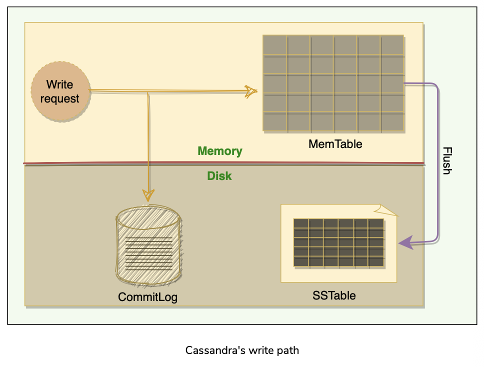
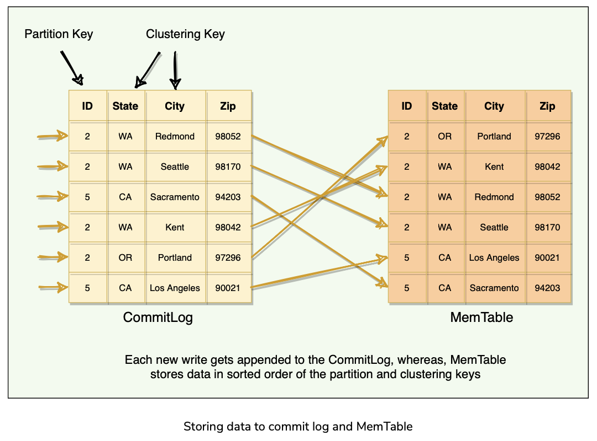
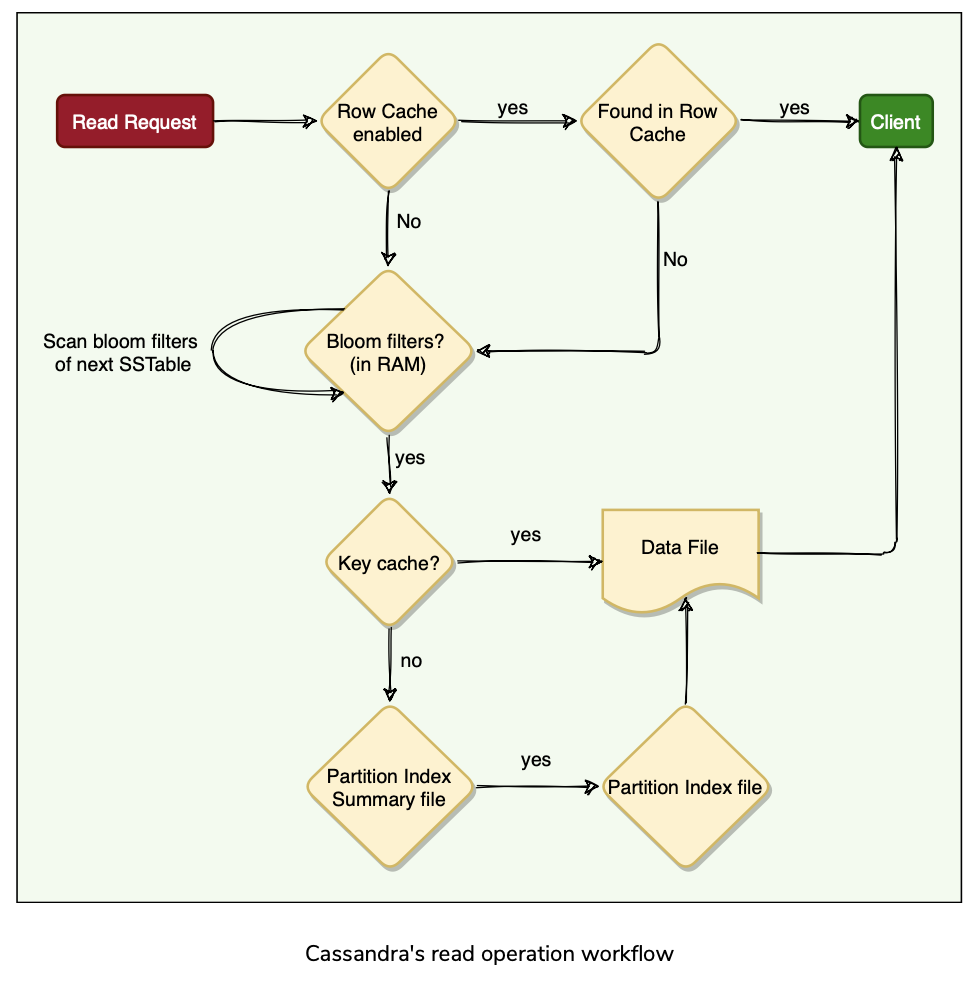
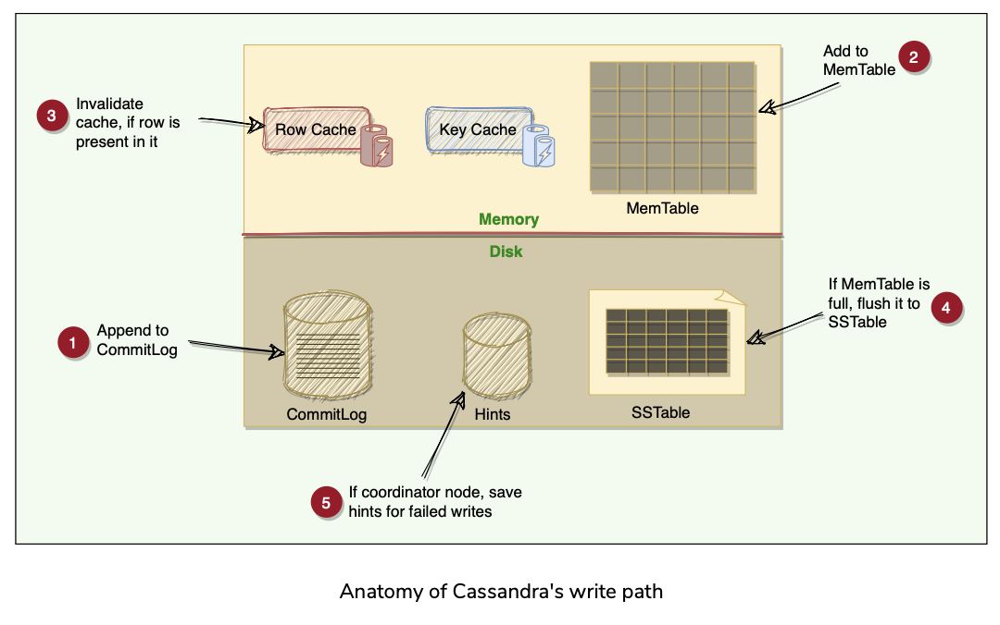
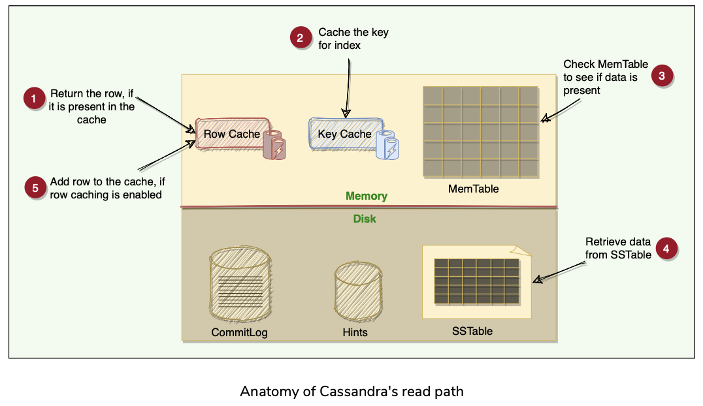

# 📊 Apache Cassandra - Wide Column NoSQL Database

## 📑 Table of Contents


1. [Overview](#-overview)
2. [Why "Wide Column" Database?](#-why-wide-column-database)
3. [Data Model](#-data-model)
4. [Use Cases](#-use-cases)
5. [Cassandra as Time-Series Database](#-cassandra-as-time-series-database)
    - [Time-Series Data Modeling Patterns](#-time-series-data-modeling-patterns)
    - [Time-Series Best Practices](#-time-series-best-practices)
    - [Time-Series Query Patterns](#-time-series-query-patterns)
6. [Partitioning & Data Distribution](#-partitioning--data-distribution)
7. [Replication](#-replication)
8. [Write Path (High Performance Secret)](#-write-path-high-performance-secret)
9. [Read Path](#-read-path)
10. [Compaction](#-compaction)
11. [Tombstones (The Delete Challenge)](#-tombstones-the-delete-challenge)
12. [High Availability Features](#-high-availability-features)
13. [Snitch (Topology Awareness)](#-snitch-topology-awareness)
14. [SSTable Storage on Disk](#-sstable-storage-on-disk)
15. [Interview Key Points](#-interview-key-points)
16. [Common Interview Questions](#-common-interview-questions)
17. [Quick Reference](#-quick-reference)
18. [Performance Tuning Tips](#-performance-tuning-tips)
19. [Best Practices](#-best-practices)

---

## 🎯 Overview

Apache Cassandra is a **distributed, highly available, eventually consistent, wide-column NoSQL database** designed to handle huge amounts of structured data across many commodity servers.

### ✨ Key Characteristics
- 🔄 **Peer-to-peer architecture** - No single point of failure
- 📈 **Linear scalability** - Performance increases linearly with added nodes
- ✍️ **Write-optimized** - Exceptional write throughput
- 🌍 **Multi-datacenter replication** - Geographic distribution support
- 🚫 **No master node** - Every node can serve client requests

---

## 🤔 Why "Wide Column" Database?

### Traditional Relational DB vs Cassandra

**Traditional Relational DB**:
```
User Table (Fixed Schema)
+----+-------+-------+-----+
| ID | Name  | Email | Age |
+----+-------+-------+-----+
| 1  | Alice | a@... | 25  |
| 2  | Bob   | b@... | 30  |
+----+-------+-------+-----+
All rows MUST have same columns
```

**Cassandra Wide Column**:
```
User Table (Flexible Schema)
+----+-------+-------+-----+---------+----------+
| ID | Name  | Email | Age | Country | Hobbies  |
+----+-------+-------+-----+---------+----------+
| 1  | Alice | a@... | 25  | USA     | Reading  |
+----+-------+-------+-----+---------+----------+
| 2  | Bob   | b@... |     |         |          |
+----+-------+-------+-----+---------+----------+
Different rows CAN have different columns!
```

**Key Insight**: Each row can have **millions of columns**!

### Real Example: User Activity Tracking
```java
// Table structure
CREATE TABLE user_activity (
    user_id UUID,
    activity_date DATE,
    // Clustering columns can be WIDE (millions possible)
    activity_timestamp TIMESTAMP,
    activity_type TEXT,
    activity_data TEXT,
    PRIMARY KEY ((user_id, activity_date), activity_timestamp)
);

// For user "Alice" on "2026-01-21":
Row 1: [user_id=Alice, date=2026-01-21]
  ├── timestamp=09:00:00 → {type: "login", data: "mobile"}
  ├── timestamp=09:15:23 → {type: "view", data: "product_123"}
  ├── timestamp=09:16:45 → {type: "cart_add", data: "product_123"}
  ├── timestamp=09:20:12 → {type: "checkout", data: "order_456"}
  └── ... (potentially millions more columns/activities)
```

### Visualization
```
Partition Key: user_id=Alice, date=2026-01-21
┌────────────────────────────────────────────────┐
│ Partition (stored together on same nodes)     │
├────────────────────────────────────────────────┤
│ Column 1: ts=09:00:00 → login                 │
│ Column 2: ts=09:15:23 → view_product          │
│ Column 3: ts=09:16:45 → add_to_cart           │
│ Column 4: ts=09:20:12 → checkout              │
│ ... (can grow to millions of columns)         │
│ Column N: ts=23:59:59 → logout                │
└────────────────────────────────────────────────┘
          ↑
     This is "WIDE"!
```

### Benefits of Wide Column Model
- 🚀 All related data in one partition (fast reads)
- 📊 Flexible schema (add columns dynamically)
- ⚡ No JOINs needed (denormalized)
- 💾 Efficient storage of sparse data

---

## 🏗️ Data Model

### Basic Building Blocks

```
📦 Column (Key-Value Pair)
   ├── Column Key: Unique identifier
   └── Column Value: Stores one or collection of values

📋 Row: Collection of columns
📁 Table: Container of rows
🗄️ Keyspace: Container for tables (spans one or more nodes)
🌐 Cluster: Container of keyspaces
💻 Node: Computer system running Cassandra instance
```

### Hierarchy
```
Cluster
  └── Keyspace(s)
       └── Table(s)
            └── Row(s)
                 └── Column(s)
```

---

## 🎯 Use Cases
Perfect for:
- ⏱️ Time-series data (IoT sensor logs)
- 📊 Streaming services
- 💬 Messaging applications
- 📝 Activity logging
- 🌡️ Weather data
- 📈 Financial transactions

---

## ⏰ Cassandra as Time-Series Database

### 🎯 Why Cassandra Excels at Time-Series?

**Time-Series Characteristics**:
1. ✍️ **Write-heavy** (continuous data ingestion)
2. 📅 **Time-ordered** (sorted by timestamp)
3. 📊 **Immutable** (historical data rarely updated)
4. 🗑️ **TTL-friendly** (old data auto-expires)

**Perfect match for Cassandra!**

### 🏗️ Time-Series Data Modeling Patterns

#### Pattern 1: IoT Sensor Data
```java
// Schema Design
CREATE TABLE sensor_readings (
    sensor_id UUID,          // Which sensor
    bucket_date DATE,        // Partition by day (prevents unbounded growth)
    reading_time TIMESTAMP,  // Clustering key (sorts data)
    temperature DOUBLE,
    humidity DOUBLE,
    pressure DOUBLE,
    PRIMARY KEY ((sensor_id, bucket_date), reading_time)
) WITH CLUSTERING ORDER BY (reading_time DESC)  // Newest first
  AND compaction = {
    'class': 'TimeWindowCompactionStrategy',
    'compaction_window_unit': 'DAYS',
    'compaction_window_size': '1'
  }
  AND default_time_to_live = 2592000;  // 30 days TTL

// Insert Example
PreparedStatement prepared = session.prepare(
    "INSERT INTO sensor_readings (sensor_id, bucket_date, reading_time, temperature, humidity, pressure) " +
    "VALUES (?, ?, ?, ?, ?, ?) USING TTL ?"
);

BoundStatement bound = prepared.bind(
    sensorId,                           // UUID
    LocalDate.now(),                    // bucket_date
    Instant.now(),                      // reading_time
    23.5,                               // temperature
    65.0,                               // humidity
    1013.25,                            // pressure
    2592000                             // 30 days in seconds
);
session.execute(bound);

// Query: Last 24 hours for sensor
ResultSet results = session.execute(
    "SELECT * FROM sensor_readings " +
    "WHERE sensor_id = ? AND bucket_date IN (?, ?) " +
    "AND reading_time > ? AND reading_time < ?",
    sensorId,
    LocalDate.now().minusDays(1),
    LocalDate.now(),
    Instant.now().minus(24, ChronoUnit.HOURS),
    Instant.now()
);
```

**📊 Data Layout**:
```
Partition 1: sensor_123, 2026-01-21
┌──────────────────────────────────────────────┐
│ 23:59:59 → {temp: 22.5, humidity: 60}       │
│ 23:59:58 → {temp: 22.5, humidity: 60}       │
│ 23:59:57 → {temp: 22.6, humidity: 61}       │
│ ... (86,400 readings per day max)            │
│ 00:00:01 → {temp: 20.1, humidity: 55}       │
│ 00:00:00 → {temp: 20.0, humidity: 55}       │
└──────────────────────────────────────────────┘
                     ↓
        Single partition read = FAST!
```

#### Pattern 2: Application Metrics
```java
// Bucketing by hour for high-frequency metrics
CREATE TABLE app_metrics (
    app_name TEXT,
    metric_name TEXT,
    hour_bucket TIMESTAMP,    // Round to hour: 2026-01-21 10:00:00
    metric_time TIMESTAMP,
    metric_value DOUBLE,
    PRIMARY KEY ((app_name, metric_name, hour_bucket), metric_time)
) WITH CLUSTERING ORDER BY (metric_time DESC)
  AND compaction = {'class': 'TimeWindowCompactionStrategy'};

// Insert Example
public void recordMetric(String appName, String metricName, double value) {
    Instant now = Instant.now();
    Instant hourBucket = now.truncatedTo(ChronoUnit.HOURS);
    
    session.execute(
        "INSERT INTO app_metrics (app_name, metric_name, hour_bucket, metric_time, metric_value) " +
        "VALUES (?, ?, ?, ?, ?)",
        appName,
        metricName,
        hourBucket,
        now,
        value
    );
}

// Query: Get last hour's CPU metrics
public List<MetricReading> getLastHourMetrics(String appName) {
    Instant now = Instant.now();
    Instant hourBucket = now.truncatedTo(ChronoUnit.HOURS);
    
    ResultSet rs = session.execute(
        "SELECT metric_time, metric_value FROM app_metrics " +
        "WHERE app_name = ? AND metric_name = ? AND hour_bucket = ?",
        appName,
        "cpu_usage",
        hourBucket
    );
    
    List<MetricReading> readings = new ArrayList<>();
    for (Row row : rs) {
        readings.add(new MetricReading(
            row.getInstant("metric_time"),
            row.getDouble("metric_value")
        ));
    }
    return readings;
}
```

#### Pattern 3: Stock Prices (Financial Time-Series)
```java
CREATE TABLE stock_prices (
    symbol TEXT,              // AAPL, GOOGL, etc.
    trade_date DATE,          // Partition by day
    trade_time TIMESTAMP,
    price DECIMAL,
    volume BIGINT,
    PRIMARY KEY ((symbol, trade_date), trade_time)
) WITH CLUSTERING ORDER BY (trade_time ASC);  // Oldest first for stock data

// Materialized View for latest price (optional)
CREATE MATERIALIZED VIEW latest_stock_price AS
    SELECT symbol, trade_date, trade_time, price, volume
    FROM stock_prices
    WHERE symbol IS NOT NULL 
      AND trade_date IS NOT NULL 
      AND trade_time IS NOT NULL
    PRIMARY KEY (symbol, trade_date, trade_time)
    WITH CLUSTERING ORDER BY (trade_date DESC, trade_time DESC);

// Insert trade
public void recordTrade(String symbol, BigDecimal price, long volume) {
    session.execute(
        "INSERT INTO stock_prices (symbol, trade_date, trade_time, price, volume) " +
        "VALUES (?, ?, ?, ?, ?)",
        symbol,
        LocalDate.now(),
        Instant.now(),
        price,
        volume
    );
}

// Query: Day's trading history
public List<Trade> getDayTrades(String symbol, LocalDate date) {
    ResultSet rs = session.execute(
        "SELECT trade_time, price, volume FROM stock_prices " +
        "WHERE symbol = ? AND trade_date = ?",
        symbol,
        date
    );
    
    return StreamSupport.stream(rs.spliterator(), false)
        .map(row -> new Trade(
            row.getInstant("trade_time"),
            row.getBigDecimal("price"),
            row.getLong("volume")
        ))
        .collect(Collectors.toList());
}
```

### 🔑 Time-Series Best Practices

#### 1. **Partition Bucketing** (Critical!)
```java
// ❌ BAD: Unbounded partition
CREATE TABLE bad_timeseries (
    sensor_id UUID,
    reading_time TIMESTAMP,
    value DOUBLE,
    PRIMARY KEY (sensor_id, reading_time)
);
// Problem: Single partition grows forever → slow reads, hotspots

// ✅ GOOD: Bounded partitions
CREATE TABLE good_timeseries (
    sensor_id UUID,
    day DATE,              // or hour, week, month
    reading_time TIMESTAMP,
    value DOUBLE,
    PRIMARY KEY ((sensor_id, day), reading_time)
);
// Benefit: Each partition has predictable size
```

**Bucketing Strategy**:
```
Data Rate         → Bucket Size
─────────────────────────────────
1/second          → Hour or Day
10/second         → Hour
100/second        → Hour (consider smaller)
1000+/second      → Minute or custom
```

#### 2. **Use Time Window Compaction Strategy**
```java
ALTER TABLE sensor_readings 
WITH compaction = {
    'class': 'TimeWindowCompactionStrategy',
    'compaction_window_unit': 'DAYS',
    'compaction_window_size': '1',
    'timestamp_resolution': 'MICROSECONDS'
};
```

**Why TWCS?**
- ✅ Time-series data rarely updated
- ✅ SSTables organized by time window
- ✅ Expired data easily dropped (no merge needed)
- ✅ Better than STCS/LCS for time-series

#### 3. **Leverage TTL (Auto-Expiration)**
```java
// Table-level default TTL
CREATE TABLE sensor_data (...) 
WITH default_time_to_live = 604800;  // 7 days

// Row-level TTL (overrides table default)
INSERT INTO sensor_data (...) 
VALUES (...) 
USING TTL 2592000;  // 30 days for this row

// No TTL for specific row (keep forever)
INSERT INTO sensor_data (...) 
VALUES (...) 
USING TTL 0;
```

#### 4. **Batching Writes**
```java
// ✅ GOOD: Batch writes to SAME partition
BatchStatement batch = new BatchStatement(BatchStatement.Type.UNLOGGED);

for (SensorReading reading : readings) {
    batch.add(prepared.bind(
        reading.getSensorId(),
        reading.getDate(),
        reading.getTime(),
        reading.getValue()
    ));
}
session.execute(batch);

// ❌ BAD: Don't batch across partitions (coordinator bottleneck)
```

#### 5. **Downsampling for Long-Term Storage**
```java
// Raw data: Keep for 7 days
CREATE TABLE sensor_readings_raw (
    sensor_id UUID,
    hour_bucket TIMESTAMP,
    reading_time TIMESTAMP,
    value DOUBLE,
    PRIMARY KEY ((sensor_id, hour_bucket), reading_time)
) WITH default_time_to_live = 604800;  // 7 days

// Aggregated data: Keep for 1 year
CREATE TABLE sensor_readings_hourly (
    sensor_id UUID,
    day DATE,
    hour INT,
    avg_value DOUBLE,
    min_value DOUBLE,
    max_value DOUBLE,
    count BIGINT,
    PRIMARY KEY ((sensor_id, day), hour)
) WITH default_time_to_live = 31536000;  // 1 year

// Background job to downsample
public void downsampleToHourly(UUID sensorId, Instant hourStart) {
    // Read raw data for hour
    ResultSet rs = session.execute(
        "SELECT value FROM sensor_readings_raw " +
        "WHERE sensor_id = ? AND hour_bucket = ?",
        sensorId, hourStart
    );
    
    // Calculate aggregates
    DoubleSummaryStatistics stats = StreamSupport
        .stream(rs.spliterator(), false)
        .mapToDouble(row -> row.getDouble("value"))
        .summaryStatistics();
    
    // Write aggregated data
    session.execute(
        "INSERT INTO sensor_readings_hourly " +
        "(sensor_id, day, hour, avg_value, min_value, max_value, count) " +
        "VALUES (?, ?, ?, ?, ?, ?, ?)",
        sensorId,
        LocalDate.from(hourStart),
        hourStart.get(ChronoField.HOUR_OF_DAY),
        stats.getAverage(),
        stats.getMin(),
        stats.getMax(),
        stats.getCount()
    );
}
```

### 📊 Time-Series Query Patterns

#### Range Queries
```java
// Query: Last 24 hours
public List<Reading> getLast24Hours(UUID sensorId) {
    Instant now = Instant.now();
    LocalDate today = LocalDate.now();
    LocalDate yesterday = today.minusDays(1);
    
    ResultSet rs = session.execute(
        "SELECT reading_time, temperature, humidity " +
        "FROM sensor_readings " +
        "WHERE sensor_id = ? AND bucket_date IN (?, ?) " +
        "AND reading_time > ?",
        sensorId,
        yesterday,
        today,
        now.minus(24, ChronoUnit.HOURS)
    );
    
    return convertToReadings(rs);
}
```

#### Aggregations (Application-Side)
```java
// Cassandra doesn't have built-in aggregations for time-series
// Calculate in application or use Spark
public Map<String, Double> calculateHourlyAverages(UUID sensorId, LocalDate date) {
    ResultSet rs = session.execute(
        "SELECT reading_time, temperature FROM sensor_readings " +
        "WHERE sensor_id = ? AND bucket_date = ?",
        sensorId, date
    );
    
    return StreamSupport.stream(rs.spliterator(), false)
        .collect(Collectors.groupingBy(
            row -> row.getInstant("reading_time")
                     .truncatedTo(ChronoUnit.HOURS)
                     .toString(),
            Collectors.averagingDouble(row -> row.getDouble("temperature"))
        ));
}
```

### 🚀 Performance Tips for Time-Series

1. **Keep Partitions Bounded**
   ```
   Rule of thumb: < 100MB per partition
   Monitor: nodetool tablehistograms
   ```

2. **Use Appropriate Compaction**
   ```
   Time-series → TWCS
   Time-series + updates → LCS
   ```

3. **Set Proper TTL**
   ```
   Automatic cleanup, no tombstone accumulation
   ```

4. **Monitor Metrics**
   ```bash
   # Check partition sizes
   nodetool tablehistograms keyspace.table
   
   # Check SSTable count
   nodetool tablestats keyspace.table
   ```

5. **Consider Data Retention Policy**
   ```
   Hot data:  Raw, 7-30 days
   Warm data: Aggregated hourly, 90 days
   Cold data: Aggregated daily, 1 year+
   ```

### 🎯 Real-World Time-Series Example

#### Netflix Viewing Analytics
```java
// Track user viewing sessions
CREATE TABLE viewing_sessions (
    user_id UUID,
    session_date DATE,
    session_start TIMESTAMP,
    content_id UUID,
    duration_seconds INT,
    playback_position INT,
    device_type TEXT,
    PRIMARY KEY ((user_id, session_date), session_start)
) WITH CLUSTERING ORDER BY (session_start DESC)
  AND compaction = {'class': 'TimeWindowCompactionStrategy'}
  AND default_time_to_live = 7776000;  // 90 days

// Insert viewing event
public void trackViewingSession(UUID userId, UUID contentId, 
                                 int duration, String device) {
    session.execute(
        "INSERT INTO viewing_sessions " +
        "(user_id, session_date, session_start, content_id, " +
        "duration_seconds, device_type) " +
        "VALUES (?, ?, ?, ?, ?, ?)",
        userId,
        LocalDate.now(),
        Instant.now(),
        contentId,
        duration,
        device
    );
}

// Query: User's recent viewing history
public List<ViewingSession> getRecentHistory(UUID userId, int days) {
    List<LocalDate> dates = IntStream.range(0, days)
        .mapToObj(i -> LocalDate.now().minusDays(i))
        .collect(Collectors.toList());
    
    ResultSet rs = session.execute(
        "SELECT session_start, content_id, duration_seconds, device_type " +
        "FROM viewing_sessions " +
        "WHERE user_id = ? AND session_date IN ?",
        userId,
        dates
    );
    
    return convertToSessions(rs);
}
```

### 📋 Time-Series Checklist

- ✅ Partition by time bucket (hour/day/week)
- ✅ Use TimeWindowCompactionStrategy
- ✅ Set appropriate TTL
- ✅ Clustering key = timestamp
- ✅ Avoid unbounded partitions
- ✅ Consider downsampling for old data
- ✅ Monitor partition sizes
- ✅ Batch writes to same partition
- ✅ Use prepared statements
- ✅ Plan retention policy upfront

---

## 🔑 Partitioning & Data Distribution

### Partitioner

The **Partitioner** determines how data is distributed across the cluster using a **consistent hash ring**.

```
Request → Partition Key → Murmur3 Hash → Token Ring → Node Assignment
```

#### 🔍 How Coordinator Finds Nodes

When a request arrives:
1. **Takes the partition key**
2. **Hashes it using Murmur3** (default hashing function)
3. **Maps hash to token ring**
4. **Builds preference list** (replica locations)

**Key Benefit**: Decouples client access from data ownership → enables linear scalability without masters

---

## 🔁 Replication

### Replication Factor (RF)
- **RF = 3** means each row stored on **3 different nodes**
- Each keyspace can have **different RF**

### 📋 Replication Strategies

#### 1️⃣ Simple Strategy
- For **single datacenter** deployments
- First replica placed by partitioner
- Subsequent replicas on **next nodes clockwise**

#### 2️⃣ Network Topology Strategy (Production Default)
- For **multi-datacenter** deployments
- Different RF per datacenter
- Rack-aware placement

### 🎯 Consistency Levels

```
Quorum = floor(RF/2 + 1)

Examples (RF = 3):
├── ONE: 1 node must respond
├── QUORUM: 2 nodes must respond  
├── ALL: 3 nodes must respond
├── LOCAL_QUORUM: Quorum in same DC
└── EACH_QUORUM: Quorum in each DC
```

**Trade-off**: Higher consistency = Higher latency

---

## 📝 Write Path (High Performance Secret)

### Write Flow
```
┌─────────────┐
│Write Request│
└──────┬──────┘
       │
       ├──────────────────┐
       ↓                  ↓
┌─────────────┐    ┌──────────┐
│ CommitLog   │    │MemTable  │
│  (Disk)     │    │ (Memory) │
│  WAL/Append │    │  Sorted  │
└─────────────┘    └────┬─────┘
                        │ (when full)
                        ↓
                  ┌──────────┐
                  │ SSTable  │
                  │  (Disk)  │
                  │Immutable │
                  └──────────┘
```


### 🔥 Why Writes Are Fast
1. **Sequential append** to CommitLog (no seek time)
2. **In-memory writes** to MemTable (fast)
3. **Batch flushes** to SSTables (efficient)
4. **No read-before-write** (unlike B-trees)

### ⚙️ Components

#### CommitLog (Write-Ahead Log)
- 💾 Durability guarantee
- 📊 Sequential writes (append-only)
- 🔄 Replayed on node restart
- 📦 **Segmented**: Multiple files, archived when data flushed

**Default**: 3 segments, each grows until threshold

#### MemTable
- 🧠 One per table per node (in-memory)
- 🔀 Stores data **sorted by partition + clustering keys**
- ⚡ Serves reads for unflushed data
- 💧 Flushed when size threshold reached


**CommitLog vs MemTable**:
```
CommitLog: Sequential Order → Fast writes
MemTable:  Sorted Order → Fast reads
```

#### SSTable (Sorted String Table)
- 💽 Immutable on-disk files
- 🔒 **Cannot be modified** after creation
- 🗑️ Updates/Deletes = New write operations
- 📑 Multiple SSTables per table



**Q: How to update/delete if immutable?**
**A**: Cassandra writes a new version with timestamp/tombstone

---

## 📖 Read Path

### Read Flow

```
Read Request
    ↓
┌─────────────┐
│  Row Cache  │ (Hot rows)
└──────┬──────┘
       │ miss
       ↓
┌─────────────┐
│  Key Cache  │ (Partition key → SSTable offset)
└──────┬──────┘
       │ miss
       ↓
┌─────────────────┐
│  Bloom Filter   │ (Key exists in SSTable?)
└──────┬──────────┘
       │ probably yes
       ↓
┌──────────────────┐
│ Partition Index  │
│  Summary (RAM)   │
└──────┬───────────┘
       ↓
┌──────────────────┐
│ Partition Index  │
│   File (Disk)    │
└──────┬───────────┘
       ↓
┌─────────────┐
│  Data File  │
└─────────────┘
```



### 🚀 Caching Layers

1. **Row Cache** 🔥
   - Caches entire frequently-read rows
   - Stored off-heap
   - Best for read-heavy workloads

2. **Key Cache** 🗝️
   - Maps partition keys → SSTable offsets
   - Stored on-heap
   - Updated on every write (can slow writes)

3. **Chunk Cache** 📦
   - Uncompressed data chunks from SSTables
   - Frequently accessed data



### 🌸 Bloom Filters
- **Probabilistic data structure**
- Tells if key **might exist** in SSTable
- **No false negatives** (if says "no", definitely not there)
- **Possible false positives** (if says "yes", might not be there)
- One per SSTable (stored in RAM)

**Benefit**: Avoids unnecessary disk reads

---

## 🔧 Compaction

### 💡 Why Compaction?

```
Problem: Multiple SSTables accumulate over time
         ↓
Solution: Merge them into fewer, larger SSTables
         ↓
Benefits: 
  - Faster reads (fewer files to check)
  - Remove deleted data (tombstones)
  - Reclaim disk space
```

### 📊 Compaction Strategies

#### 1️⃣ Size-Tiered Compaction Strategy (STCS)
- Merges SSTables of **similar size**
- **Best for**: Write-heavy, time-series data
- **Drawback**: Can use 2x disk space temporarily

#### 2️⃣ Leveled Compaction Strategy (LCS)
- Organizes SSTables into **levels** (L0, L1, L2...)
- Each level 10x larger than previous
- **Best for**: Read-heavy workloads
- **Benefit**: Predictable read performance

#### 3️⃣ Time-Window Compaction Strategy (TWCS)
- Compacts within **time windows**
- **Best for**: Time-series with TTL
- **Example**: Compact hourly/daily buckets

---

## 🪦 Tombstones (The Delete Challenge)

### 🤔 The Problem
```
Node A: DELETE key=123
Node B: Offline (missed the delete)
         ↓
Node B comes back online
         ↓
Repair runs → Node B resurrects deleted data! 😱
```

### ✅ The Solution: Tombstones
- Delete = **Soft delete** (mark with tombstone)
- Tombstone = marker with **timestamp**
- Default TTL: **10 days** (gc_grace_seconds)
- Removed during compaction

### ⚠️ Tombstone Problems
```java
// Anti-pattern: Many deletes
for (int i = 0; i < 1000000; i++) {
    session.execute("DELETE FROM users WHERE id = ?", i);
}
// Creates 1M tombstones → slow reads!
```

**Impact**: Accumulated tombstones → slow reads → timeouts

**Best Practice**: Use TTL for auto-expiring data instead of explicit deletes

---

## 🛡️ High Availability Features

### 🤝 Hinted Handoff

When a node is **down**:
```
1. Coordinator receives write
2. Target node is unavailable
3. Coordinator stores "hint" on local disk
   (hint = data + target node info)
4. Every 10 minutes, checks if target recovered
5. Replays hints when target is back
```

**Limitations**:
- ⚠️ Hints stored for **3 hours** (default)
- ⚠️ Data lost if coordinator dies
- ⚠️ Not a replacement for repair

### 👥 Gossip Protocol

**Purpose**: Node discovery and failure detection

Every node, **every second**:
```
1. Picks 1-3 random nodes
2. Exchanges state information
   - Endpoint state
   - Generation number
   - Heartbeat
   - Application state
3. Updates local view of cluster
```

#### Generation Number
- Incremented on **node restart**
- Helps detect node restarts vs. network issues

### 🩺 Failure Detection: Phi Accrual

**Traditional Heartbeat**: Boolean (alive/dead)
```
Problem: Hard to pick timeout
  - Too short → false positives
  - Too long → slow detection
```

**Phi Accrual Solution**: Suspicion level (0 to ∞)
```
Φ (phi) value:
├── 0-1: Healthy
├── 1-5: Slightly suspicious
├── 5-8: Moderately suspicious  
└── 8+: Likely dead (default threshold = 8)
```

**Adaptive**: Uses **historical heartbeat data** to adjust threshold

---

## 🕵️ Snitch (Topology Awareness)

**Purpose**: Understands cluster topology

**Responsibilities**:
1. 🗺️ Determines datacenter/rack of nodes
2. ⚡ Monitors read latencies
3. 📍 Guides replica placement
4. 🚫 Avoids slow nodes

**Common Snitches**:
- **SimpleSnitch**: Single datacenter
- **GossipingPropertyFileSnitch**: Multi-DC (production)
- **Ec2Snitch**: AWS deployments
- **GoogleCloudSnitch**: GCP deployments

---

## 💾 SSTable Storage on Disk

Each SSTable consists of:

```
📂 SSTable Components
├── 📄 Data File (actual data)
├── 🔑 Partition Index (partition key → offset)
├── 📋 Partition Summary (in RAM, subset of index)
├── 🌸 Bloom Filter (in RAM)
├── 📊 Statistics (metadata)
└── 🗜️ Compression Info
```

---

## 🎓 Interview Key Points

### 🔥 Why Cassandra for Writes?
```
1. Append-only CommitLog (sequential I/O)
2. In-memory MemTable (RAM speed)
3. Batch writes to SSTables
4. No locks/latches needed
5. Linear scalability
```

### 📖 Why Reads Can Be Slower?
```
1. Check MemTable
2. Check Row Cache
3. Scan multiple SSTables
4. Merge results by timestamp
5. Return latest version
```

**Solution**: Compaction + proper cache tuning

### ⚖️ CAP Theorem Position
```
Cassandra = AP System
├── A: Availability (always responds)
├── P: Partition Tolerance (works during network splits)
└── C: Eventually Consistent (tunable)
```

**Tunable Consistency**: Can achieve CP by using QUORUM/ALL

### 🎯 When to Use Cassandra?
✅ **Good for**:
- High write throughput needs
- Linear scalability required
- Multi-datacenter deployment
- Time-series data
- No complex joins needed

❌ **Bad for**:
- Complex queries/joins
- Strong ACID transactions
- Frequent updates/deletes
- Small datasets (<100GB)

---

## 🛠️ Common Interview Questions

### Q1: How does Cassandra achieve high write performance?
**Answer**: 
- Sequential writes to CommitLog (append-only)
- In-memory MemTable for immediate acknowledgment
- No read-before-write
- Batch flushes to immutable SSTables
- No locking required

### Q2: Explain the read path in Cassandra
**Answer**:
1. Check Row Cache → return if hit
2. Check Bloom filters of SSTables
3. Use Key Cache or Partition Index to find location
4. Read from MemTable + relevant SSTables
5. Merge results using timestamp (last write wins)
6. Return to client

### Q3: What are tombstones and why are they problematic?
**Answer**:
- Tombstones mark deleted data (soft delete)
- Needed for eventual consistency
- Problem: Accumulation slows reads (must scan all tombstones)
- Solution: Use TTL, tune gc_grace_seconds, monitor tombstone warnings

### Q4: Difference between Cassandra and MongoDB?
**Answer**:
```
Cassandra:
- Wide-column store
- AP (Available, Partition-tolerant)
- Peer-to-peer (no master)
- Better for writes
- Multi-DC built-in

MongoDB:
- Document store
- CP (Consistent, Partition-tolerant)
- Primary-Secondary (has master)
- Flexible schema
- Better for complex queries
```

### Q5: How to choose consistency level?
**Answer**:
```
Use Case → Consistency Level
├── Strong consistency → QUORUM/ALL
├── Fast reads → ONE
├── Fast writes → ONE
├── Multi-DC consistency → LOCAL_QUORUM
└── Critical data → EACH_QUORUM
```

### Q6: Why is Cassandra called a "Wide Column" database?
**Answer**:
- Each row can have different columns (flexible schema)
- Single partition can contain millions of columns (wide)
- Columns are not fixed across rows
- Example: User activity partition can have millions of timestamp-based columns
- "Wide" refers to the unlimited columns per partition, not table width

### Q7: How to use Cassandra for time-series data?
**Answer**:
Key strategies:
- **Partition by time buckets** (hour/day) to prevent unbounded growth
- Use **TimeWindowCompactionStrategy** for efficient old data removal
- Implement **TTL** for automatic data expiration
- **Clustering by timestamp** for sorted reads
- Example: `PRIMARY KEY ((sensor_id, day), timestamp)`
- Downsample old data for long-term storage

---

## 📚 Quick Reference

### Consistency Formulas
```
Quorum = floor(RF/2) + 1

For RF=3:
- Quorum = 2
- Strong consistency: Read(QUORUM) + Write(QUORUM)
```

### Key Terminology Cheat Sheet
```
🔑 Partition Key: Determines node placement
🔀 Clustering Key: Determines sort order within partition
📊 Primary Key: Partition Key + Clustering Key(s)
💍 Token: Hash of partition key
🔄 Replica: Copy of data on different node
⏱️ Timestamp: Conflict resolution (last write wins)
🪦 Tombstone: Soft delete marker
🌸 Bloom Filter: Probabilistic existence check
```

---

## 🚀 Performance Tuning Tips

1. **Choose appropriate Compaction Strategy** for workload
2. **Tune cache sizes** based on RAM availability
3. **Use TTL** instead of deletes when possible
4. **Monitor tombstone warnings** in logs
5. **Partition data evenly** (avoid hot partitions)
6. **Use appropriate consistency levels** (don't always use QUORUM)
7. **Enable compression** for large datasets
8. **Run regular repairs** in multi-DC setups

---

## ✅ Best Practices

### Data Modeling
```java
// ✅ Good: Time-series partition
CREATE TABLE sensor_data (
    sensor_id UUID,
    day DATE,
    hour INT,
    reading DOUBLE,
    PRIMARY KEY ((sensor_id, day), hour)
);

// ❌ Bad: Unbounded partition
CREATE TABLE user_events (
    user_id UUID,
    event_time TIMESTAMP,
    event_data TEXT,
    PRIMARY KEY (user_id, event_time)
);
// Problem: One user's partition grows forever
```

### Write Patterns
```java
// ✅ Good: Batch same partition
BatchStatement batch = new BatchStatement();
batch.add(insert1); // same partition key
batch.add(insert2); // same partition key
session.execute(batch);

// ❌ Bad: Batch different partitions
// Coordinator becomes bottleneck
```

---

**Last Updated**: January 2026
**Version**: Cassandra 4.x+

---

*💡 Pro Tip: Always model your queries first, then design your tables. "Model your queries, not your data!"*